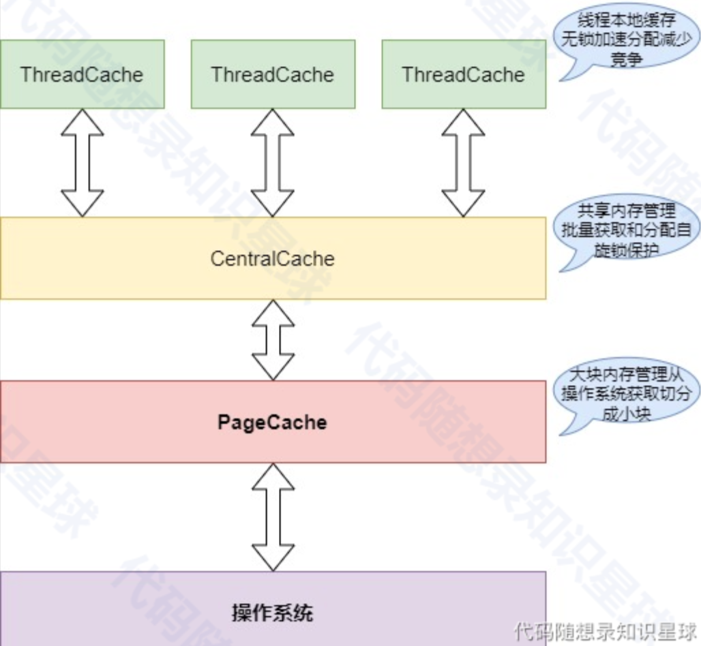
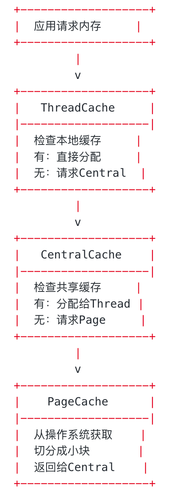

# memory-pool
## 整体介绍
项目实现了一个高效的内存池，旨在优化内存分配和释放的性能，特别是在多线程环境下。内存池通过分层缓存架构来管理内存，主要包括以下三层：
1. ThreadCache (线程本地缓存)
- 每个线程独立的内存缓存
- 无锁操作，快速分配和释放
- 减少线程间竞争，提高并发性能
2. CentralCache (中心缓存)
- 管理多个线程共享的内存块
- 通过自旋锁保护，确保线程安全
- 批量从PageCache获取内存，分配给ThreadCache
3. PageCache (页缓存)
- 从操作系统获取大块内存
- 将大块内存切分成小块，供CentralCache使用
- 负责内存的回收和再利用
## 内存池架构图

## 执行流程图
